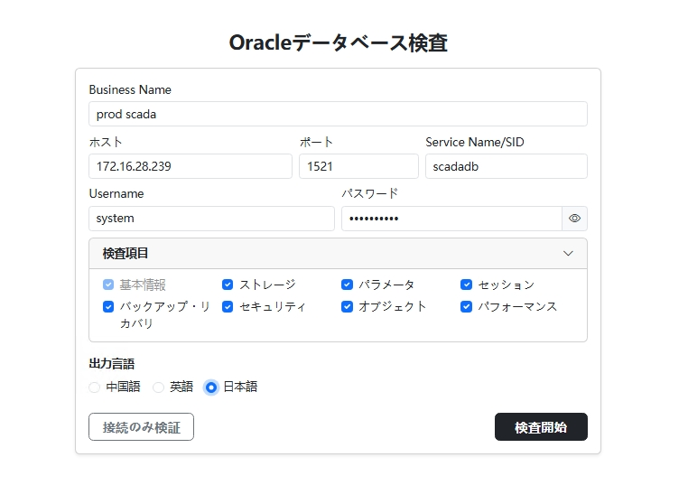
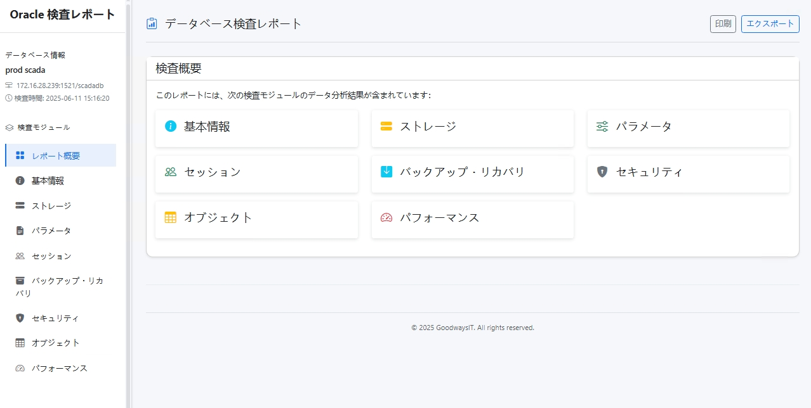
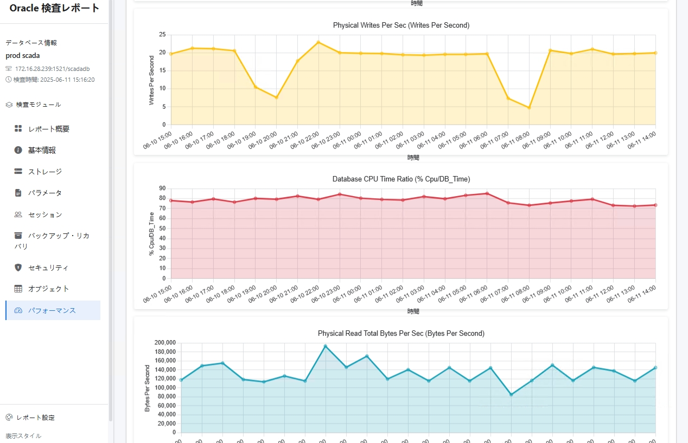
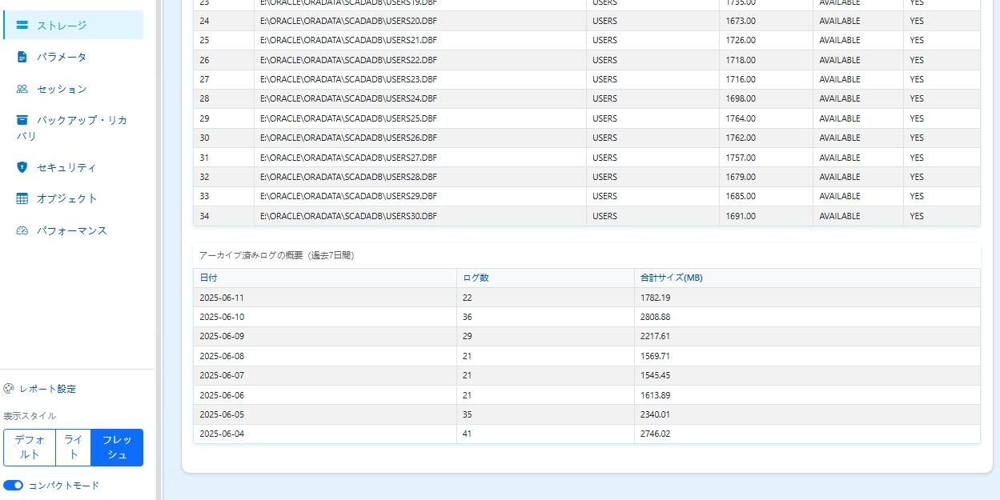

[English](README.md) | [日本語](README-ja.md) | [简体中文](README-zh.md)

# Inspect4Oracle - Oracle データベース検査ツール

[](https://goreportcard.com/report/github.com/goodwaysIT/inspect4oracle)
[](https://opensource.org/licenses/MIT)

**Inspect4Oracleは、データベース管理者（DBA）、開発者、運用エンジニアがOracleデータベースの稼働状況と健全性を迅速かつ包括的に把握するのを支援するために設計された、強力で使いやすく、オープンソースのOracleデータベース検査ツールです。**

直感的なWebインターフェースを通じて、ユーザーはターゲットデータベースに簡単に接続し、関心のある検査モジュールを選択し、豊富なチャートとデータを含むインタラクティブな検査レポートを生成できます。

## ✨ プロジェクトのハイライトと利点

*   **包括的な検査**: データベースの基本情報、パラメータ設定、ストレージ容量、オブジェクトの状態、パフォーマンス指標、バックアップとリカバリ、セキュリティ設定など、主要な領域をカバーする複数のコア検査モジュールを内蔵。
*   **ユーザーフレンドリー**: 最新のWebユーザーインターフェースを提供し、操作はシンプルで直感的。複雑なコマンドライン操作は不要です。
*   **インタラクティブレポート**: 生成されるレポートには、動的なチャートとソート可能なテーブルが含まれており、ユーザーはデータを詳細に分析できます。
*   **ワンクリックエクスポート**: 検査レポートをHTML形式でエクスポートでき、共有やオフラインでの閲覧が容易です。
*   **簡単なデプロイ**: Go言語で開発され、コンパイル後は単一の実行ファイルになります。静的リソースが組み込まれているため、追加の依存関係なしで迅速かつ簡単にデプロイできます。
*   **クロスプラットフォーム対応**: Windows、Linux、macOSなどの主要なオペレーティングシステムで動作します。
*   **オープンソース＆無料**: プロジェクトは完全にオープンソースであり、自由に使用、変更、配布できます。
*   **高い拡張性**: 明確なモジュール設計により、コミュニティ開発者が新しい検査モジュールや機能を簡単に追加できます。
*   **セキュアな接続**: 詳細な接続情報の入力をサポート。検査プロセス中にデータベースの認証情報は保存されず、データの安全性が確保されます。

## 🎯 対象ユーザー

*   **データベース管理者 (DBA)**: 日常的な検査、トラブルシューティング、パフォーマンスチューニング、セキュリティ監査に。
*   **開発者**: データベース環境の設定を理解し、アプリケーション関連のデータベースオブジェクトとパフォーマンスを分析するために。
*   **運用エンジニア**: データベースの状態を監視し、ビジネスシステムの安定稼働を確保するために。
*   **データベース初心者**: 検査レポートを通じてOracleデータベースの内部構造と主要な指標を学ぶために。

## 📸 スクリーンショット

クリアなデータベース接続インターフェース：

直感的な検査レポートの概要：

豊富なインタラクティブチャート表示：

柔軟な検査モジュールの選択とレポート生成：


## 🚀 クイックスタート

### 1. プログラムの入手

*   **コンパイル済みバージョンのダウンロード (推奨)**:
    プロジェクトの [GitHub Releases](https://github.com/goodwaysIT/inspect4oracle/releases) ページにアクセスし、お使いのオペレーティングシステム用の最新のコンパイル済みバージョンをダウンロードしてください。
*   **ソースからのビルド**:
    自分でビルドしたい場合は、プロジェクトの [BUILD-ja.md](./BUILD-ja.md) ビルドガイドを参照してください。

### 2. プログラムの実行

以下の方法でプログラムを実行できます：

*   **`go run` を使用 (Go開発環境が設定されている場合)**:
    ```bash
    go run main.go
    ```
    （`main.go`が実際のエントリファイル名と異なる場合は置き換えてください）

*   **コンパイル済みの実行ファイルを直接実行**:
    ダウンロードまたはビルド後、実行ファイルを直接実行します：

*   **Windows**: `inspect4oracle.exe` をダブルクリックするか、コマンドラインで `inspect4oracle.exe` を実行します。
*   **Linux / macOS**: ターミナルで `./inspect4oracle` を実行します。

プログラムが起動すると、リッスンしているIPアドレスとポート番号が表示されます。デフォルトは `http://0.0.0.0:8080` です。

`-h` または `--help` パラメータを使用して、利用可能なすべてのコマンドラインオプションを確認できます。例：
```bash
# Windows
inspect4oracle.exe -h

# Linux / macOS
./inspect4oracle -h
```
これにより、異なるリッスンポートの指定方法やデバッグモードの有効化などが表示されます。

### 3. 検査の開始

1.  Webブラウザを開き、プログラム起動時に表示されたアドレス（例: `http://localhost:8080`）にアクセスします。
2.  ホームページの接続フォームに、Oracleデータベースの接続情報（ホスト、ポート、サービス名/SID、ユーザー名、パスワード）を入力します。
3.  「接続を検証」をクリックして、接続情報が正しく、ユーザーが必要なクエリ権限を持っていることを確認します。
4.  検査したいモジュールを選択します。
5.  「検査を開始」ボタンをクリックします。
6.  検査が完了すると、生成された検査レポートページに自動的にリダイレクトされます。
7.  レポートを閲覧し、チャートを操作し、レポートページのエクスポート機能を使ってレポートをHTMLファイルとして保存できます。

> **注意**:
> 最も包括的な検査情報を取得し、すべてのモジュールが正常に動作することを保証するため、`SYSTEM` ユーザーを使用して検査を実行することをお勧めします。
>
> 権限が制限された一般ユーザーで検査を実行したい場合は、そのユーザーに関連するデータディクショナリビューおよび動的パフォーマンスビュー（`V$`ビュー、`DBA_`ビューなど）への必要なクエリ権限が付与されていることを確認してください。以下は、プログラム内部の権限チェックリストに基づいて生成された基本的な権限付与SQLスクリプトの例です。検査するモジュールやデータベースのバージョンに応じて調整・補足してください：
```sql
-- 以下のV$ビューへのSELECT権限を付与:
GRANT SELECT ON V_$ACTIVE_SESSION_HISTORY TO YOUR_USER;
GRANT SELECT ON V_$ASM_DISKGROUP TO YOUR_USER; -- ASMを使用し、チェックが必要な場合
GRANT SELECT ON V_$DATABASE TO YOUR_USER;
GRANT SELECT ON V_$INSTANCE TO YOUR_USER;
GRANT SELECT ON V_$SESSION TO YOUR_USER;
GRANT SELECT ON V_$SQL TO YOUR_USER;
GRANT SELECT ON V_$SQLAREA TO YOUR_USER;
GRANT SELECT ON V_$SYSMETRIC TO YOUR_USER;
GRANT SELECT ON V_$SYSTEM_PARAMETER TO YOUR_USER;
GRANT SELECT ON V_$TEMP_EXTENT_POOL TO YOUR_USER;
GRANT SELECT ON V_$VERSION TO YOUR_USER;

-- 以下のDBA_ビューへのSELECT権限を付与:
GRANT SELECT ON DBA_DATA_FILES TO YOUR_USER;
GRANT SELECT ON DBA_FREE_SPACE TO YOUR_USER;
GRANT SELECT ON DBA_OBJECTS TO YOUR_USER;
GRANT SELECT ON DBA_ROLES TO YOUR_USER;
GRANT SELECT ON DBA_ROLE_PRIVS TO YOUR_USER;
GRANT SELECT ON DBA_SEGMENTS TO YOUR_USER;
GRANT SELECT ON DBA_SYS_PRIVS TO YOUR_USER;
GRANT SELECT ON DBA_TABLESPACES TO YOUR_USER;
GRANT SELECT ON DBA_TEMP_FILES TO YOUR_USER;
GRANT SELECT ON DBA_USERS TO YOUR_USER;

-- 有効にする検査モジュールによっては、他の権限が必要になる場合があります。例:
-- GRANT SELECT ON V_$PARAMETER TO YOUR_USER; (V_$SYSTEM_PARAMETERの代替)
-- GRANT SELECT ON DBA_PROFILES TO YOUR_USER; (セキュリティモジュール)
-- GRANT SELECT ON V_$RMAN_BACKUP_JOB_DETAILS TO YOUR_USER; (バックアップモジュール)
-- GRANT SELECT ON V_$FLASHBACK_DATABASE_LOG TO YOUR_USER; (バックアップモジュール)
-- GRANT SELECT ON DBA_RECYCLEBIN TO YOUR_USER; (バックアップモジュール)
-- GRANT SELECT ON DBA_DATAPUMP_JOBS TO YOUR_USER; (バックアップモジュール)
-- GRANT SELECT ON DBA_AUDIT_TRAIL TO YOUR_USER; (従来の監査を使用する場合)
-- ... 実際の検査範囲とエラーログに基づいて、さらに権限を追加してください ...
```

## 📦 コア検査モジュール

Inspect4Oracleは、以下のコア検査モジュールを提供します（一部のモジュールはまだ開発中の場合があります。プロジェクトの進捗にご注目ください）：

*   **`dbinfo` (データベース情報)**:
    *   データベースのバージョン、インスタンス情報、起動時間、プラットフォーム情報など。
    *   NLSパラメータ設定。
*   **`parameters` (パラメータ設定)**:
    *   デフォルト以外のデータベースパラメータとその値のリスト。
    *   重要な隠しパラメータ（必要に応じて）。
*   **`storage` (ストレージ管理)**:
    *   テーブルスペースの使用状況（合計、使用済み、空き、使用率）。
    *   データファイル情報。
    *   制御ファイルとREDOログファイルの状態。
    *   ASMディスクグループ情報（データベースがASMを使用している場合）。
*   **`objects` (オブジェクトの状態)**:
    *   無効なオブジェクトのリスト（OWNER, OBJECT_NAME, OBJECT_TYPE）。
    *   オブジェクトタイプの統計。
    *   大きなオブジェクト/セグメントの情報（サイズ別トップセグメント）。
*   **`performance` (パフォーマンス分析)**:
    *   主要な待機イベント。
    *   現在のセッション情報。
    *   SGA/PGAメモリ使用状況。
    *   ヒット率（バッファキャッシュヒット率、ライブラリキャッシュヒット率など）。
    *   （さらなるパフォーマンス指標を計画中）
*   **`backup` (バックアップとリカバリ)**:
    *   アーカイブログモードの状態。
    *   最近のRMANバックアップジョブの記録（成功/失敗）。
    *   フラッシュバックデータベースの状態と領域使用量。
    *   ごみ箱のオブジェクト情報。
    *   Data Pumpジョブの履歴。
*   **`security` (セキュリティ監査)**:
    *   非システムユーザー情報（状態、ロック/有効期限、デフォルトテーブルスペース、プロファイル）。
    *   DBAなどの高権限ロールを持つユーザー。
    *   ユーザーのシステム権限リスト。
    *   プロファイル設定（特にパスワードポリシー関連のパラメータ、例：`FAILED_LOGIN_ATTEMPTS`, `PASSWORD_LIFE_TIME`）。
    *   非システムロールのリスト。
    *   （監査設定など、さらなるセキュリティ機能を計画中）

## 🛠️ 技術スタックと主要な依存関係

このプロジェクトは主にGo言語（バージョンは`go.mod`を参照）で構築されており、主要な機能を提供するために以下のコアなサードパーティライブラリに依存しています：

*   **[github.com/gorilla/mux](https://github.com/gorilla/mux)**: APIおよびWebインターフェースのリクエストルーティングを処理するための、強力で柔軟なHTTPルーターおよびURLマッチャー。
*   **[github.com/sijms/go-ora/v2](https://github.com/sijms/go-ora/v2)**: 純粋なGoで実装されたOracleデータベースドライバ。これにより、アプリケーションはOracle Instant Clientに依存せずにOracleデータベースに接続し、操作できます。

依存関係の完全なリストとそのバージョンについては、プロジェクトルートの`go.mod`ファイルを参照してください。

## 🤝 貢献

コミュニティ開発者の皆様がInspect4Oracleプロジェクトに貢献してくださることを心から歓迎します！バグの報告、機能の提案、あるいは直接コードを貢献していただくこと、そのすべてがプロジェクトにとって非常に重要です。

### 貢献方法

1.  **問題の報告 (Bugs)**: 使用中に問題を発見した場合は、GitHub Issuesを通じて詳細なバグレポートを提出してください。
2.  **機能の提案**: 新しい機能のアイデアや改善提案がある場合も、GitHub Issuesを通じて提案してください。
3.  **コードの貢献**:
    *   このリポジトリを自分のGitHubアカウントにフォークします。
    *   新しいブランチを作成します（例: `feature/your-new-feature` or `fix/issue-number`）。
    *   自分のブランチで変更と開発を行います。
    *   コードがプロジェクトの既存のコーディングスタイルと規約に従っていることを確認します。
    *   変更をコミットし、フォークしたリポジトリにプッシュします。
    *   メインリポジトリの`main`（または`develop`）ブランチに対してプルリクエスト（PR）を作成し、変更内容を詳細に説明します。

## 📜 ライセンス

このプロジェクトは[MITライセンス](LICENSE)の下でオープンソース化されています。
