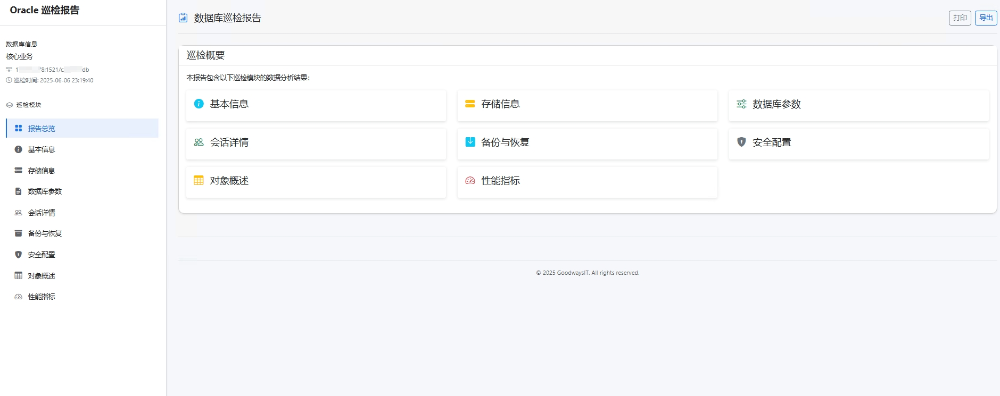

# Inspect4Oracle - Oracle 数据库巡检利器

**Inspect4Oracle 是一款强大、易用、开源的 Oracle 数据库巡检工具，旨在帮助数据库管理员 (DBA)、开发人员和运维工程师快速、全面地了解 Oracle 数据库的运行状态和健康状况。**

通过直观的 Web 界面，用户可以轻松连接到目标数据库，选择感兴趣的巡检模块，生成包含丰富图表和数据的交互式巡检报告。

## ✨ 项目亮点与优势

*   **全面巡检**: 内置多个核心巡检模块，覆盖数据库基本信息、参数配置、存储空间、对象状态、性能指标、备份恢复以及安全配置等关键领域。
*   **用户友好**: 提供现代化的 Web 用户界面，操作简单直观，无需复杂的命令行操作。
*   **交互式报告**: 生成的报告包含动态图表和可排序表格，方便用户深入分析数据。
*   **一键导出**: 支持将巡检报告导出为 HTML 格式，便于分享和离线查阅。
*   **轻松部署**: 基于 Go 语言开发，编译后为单个可执行文件，内置静态资源，无需额外依赖，部署简单快捷。
*   **跨平台运行**: 支持在 Windows, Linux, macOS 等主流操作系统上运行。
*   **开源免费**: 项目完全开源，您可以自由使用、修改和分发。
*   **高度可扩展**: 清晰的模块化设计，方便社区开发者贡献新的巡检模块和功能。
*   **安全连接**: 支持输入详细的连接信息，巡检过程不存储数据库凭证，保障数据安全。

## 🎯 目标用户

*   **数据库管理员 (DBA)**: 进行日常巡检、故障排查、性能优化和安全审计。
*   **开发人员**: 了解数据库环境配置，分析应用相关的数据库对象和性能。
*   **运维工程师**: 监控数据库状态，确保业务系统的稳定运行。
*   **数据库初学者**: 通过巡检报告学习 Oracle 数据库的内部结构和关键指标。

## 📸 界面截图

## 🚀 快速开始

### 1. 获取程序

*   **下载预编译版本 (推荐)**:
    前往本项目的 [GitHub Releases](https://github.com/goodwaysIT/inspect4oracle/releases) 页面下载适用于您操作系统的最新预编译版本。
*   **从源码构建**:
    如果您希望自行构建，请参考项目的 [BUILD-zh.md](./BUILD-zh.md) 构建指南。

### 2. 运行程序

下载或构建完成后，直接运行可执行文件：

*   **Windows**: 双击 `inspect4oracle.exe` 或在命令行运行 `inspect4oracle.exe`。
*   **Linux / macOS**: 在终端运行 `./inspect4oracle`。

程序启动后，会显示监听的 IP 地址和端口号，默认为 `http://0.0.0.0:8080`。

### 3. 开始巡检

1.  打开您的 Web 浏览器，访问程序启动时提示的地址 (例如 `http://localhost:8080`)。
2.  在首页的连接表单中，输入您的 Oracle 数据库的连接信息 (主机、端口、服务名/SID、用户名、密码)。
3.  点击“验证连接”以确保连接信息正确且用户拥有必要的查询权限。
4.  选择您希望巡检的模块。
5.  点击“开始巡检”按钮。
6.  巡检完成后，系统将自动跳转到生成的巡检报告页面。
7.  您可以浏览报告、与图表交互，并通过报告页面的导出功能将报告保存为 HTML 文件。

## 📦 核心巡检模块

Inspect4Oracle 提供以下核心巡检模块 (部分模块可能仍在开发中，欢迎关注项目进展)：

*   **`dbinfo` (数据库信息)**:
    *   数据库版本、实例信息、启动时间、平台信息等。
    *   NLS 参数设置。
*   **`parameters` (参数配置)**:
    *   非默认数据库参数列表及其值。
    *   重要的隐藏参数 (按需)。
*   **`storage` (存储管理)**:
    *   表空间使用情况 (总量、已用、可用、百分比)。
    *   数据文件信息。
    *   控制文件和重做日志文件状态。
    *   ASM 磁盘组信息 (如果数据库使用 ASM)。
*   **`objects` (对象状态)**:
    *   无效对象列表 (OWNER, OBJECT_NAME, OBJECT_TYPE)。
    *   对象类型统计。
    *   大对象/段信息 (Top Segments by size)。
*   **`performance` (性能分析)**:
    *   关键等待事件。
    *   当前会话信息。
    *   SGA/PGA 内存使用情况。
    *   命中率 (Buffer Cache Hit Ratio, Library Cache Hit Ratio等)。
    *   (更多性能指标正在规划中)
*   **`backup` (备份与恢复)**:
    *   归档模式状态。
    *   最近 RMAN 备份任务记录 (成功/失败)。
    *   闪回数据库状态和空间使用。
    *   回收站对象信息。
    *   Data Pump 任务历史。
*   **`security` (安全审计)**:
    *   非系统用户信息 (状态、锁定/过期、默认表空间、Profile)。
    *   拥有 DBA 等高权限角色的用户。
    *   用户系统权限列表。
    *   Profile 配置 (特别是密码策略相关参数，如 `FAILED_LOGIN_ATTEMPTS`, `PASSWORD_LIFE_TIME`)。
    *   非系统角色列表。
    *   (审计配置等更多安全特性正在规划中)

## 🤝 参与贡献

我们热烈欢迎社区的开发者参与到 Inspect4Oracle 项目的贡献中来！无论是报告 Bug、提出功能建议，还是直接贡献代码，您的帮助对项目都至关重要。

### 如何贡献

1.  **报告问题 (Bugs)**: 如果您在使用过程中发现任何问题，请通过 GitHub Issues 提交详细的 Bug 报告。
2.  **功能建议**: 如果您有新的功能想法或改进建议，也请通过 GitHub Issues 提出。
3.  **贡献代码**:
    *   Fork 本仓库到您的 GitHub 账户。
    *   创建一个新的分支 (例如 `feature/your-new-feature` 或 `fix/issue-number`)。
    *   在您的分支上进行修改和开发。
    *   确保您的代码遵循项目现有的编码风格和规范。
    *   提交您的更改，并推送到您的 Fork 仓库。
    *   创建一个 Pull Request (PR) 到主仓库的 `main` (或 `develop`) 分支，并详细描述您的更改内容。

### 开发设置 (简要)

*   安装 Go (最新稳定版)。
*   Clone 您的 Fork 仓库到本地。
*   (更多详细的开发环境设置和指南，请参考相关文档或咨询项目维护者。)

## 📜 开源许可

本项目基于 [MIT License](LICENSE) 开源。

## 🙏 致谢 (可选)

*   感谢所有为本项目提供灵感和支持的开源社区和工具。
*   (可以列出一些关键的依赖库，如果它们有特殊要求的话)

---

希望这份 `README-zh.md` 能帮助您的项目吸引更多关注！
