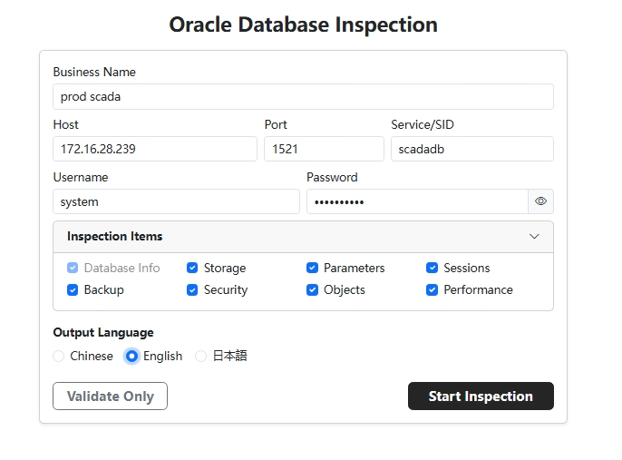
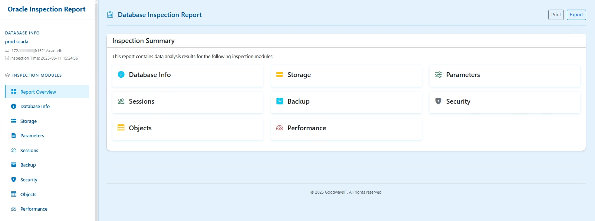
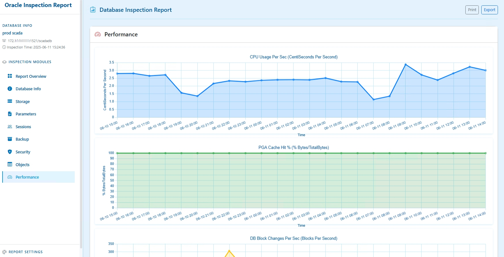
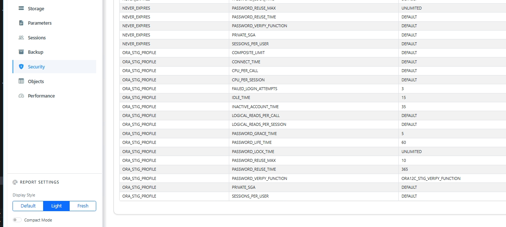

[English](README.md) | [日本語](README-ja.md) | [简体中文](README-zh.md)

# Inspect4Oracle - The Oracle Database Inspection Tool

[](https://goreportcard.com/report/github.com/goodwaysIT/inspect4oracle)
[](https://opensource.org/licenses/MIT)

**Inspect4Oracle is a powerful, easy-to-use, and open-source Oracle database inspection tool designed to help Database Administrators (DBAs), developers, and operations engineers quickly and comprehensively understand the operational status and health of Oracle databases.**

Through an intuitive web interface, users can easily connect to a target database, select inspection modules of interest, and generate interactive inspection reports rich with charts and data.

## ✨ Highlights and Advantages

*   **Comprehensive Inspection**: Built-in core inspection modules covering key areas such as basic database information, parameter configuration, storage space, object status, performance metrics, backup and recovery, and security settings.
*   **User-Friendly**: Provides a modern web user interface that is simple and intuitive, eliminating the need for complex command-line operations.
*   **Interactive Reports**: Generated reports include dynamic charts and sortable tables, allowing users to perform in-depth data analysis.
*   **One-Click Export**: Supports exporting inspection reports to HTML format for easy sharing and offline viewing.
*   **Easy Deployment**: Developed in Go, it compiles into a single executable file with embedded static assets, requiring no external dependencies for quick and easy deployment.
*   **Cross-Platform**: Supports running on major operating systems like Windows, Linux, and macOS.
*   **Open-Source and Free**: The project is completely open-source, allowing you to use, modify, and distribute it freely.
*   **Highly Extensible**: A clear, modular design makes it easy for community developers to contribute new inspection modules and features.
*   **Secure Connection**: Supports detailed connection information input. The inspection process does not store database credentials, ensuring data security.

## 🎯 Target Users

*   **Database Administrators (DBAs)**: For daily inspections, troubleshooting, performance tuning, and security audits.
*   **Developers**: To understand the database environment configuration and analyze application-related database objects and performance.
*   **Operations Engineers**: To monitor database status and ensure the stable operation of business systems.
*   **Database Beginners**: To learn about the internal structure and key metrics of Oracle databases through inspection reports.

## 📸 Screenshots

Clear database connection interface:


Intuitive inspection report overview:


Rich interactive chart display:


Flexible inspection module selection and report generation:


## 🚀 Quick Start

### 1. Get the Application

*   **Download Pre-compiled Version (Recommended)**:
    Go to the project's [GitHub Releases](https://github.com/goodwaysIT/inspect4oracle/releases) page to download the latest pre-compiled version for your operating system.
*   **Build from Source**:
    If you wish to build it yourself, please refer to the project's [BUILD.md](./BUILD.md) guide.

### 2. Run the Application

You can run the application in the following ways:

*   **Via `go run` (for environments with Go development setup)**:
    ```bash
    go run main.go
    ```
    (Replace `main.go` with the actual project entry file name if it's different)

*   **Directly run the pre-compiled executable**:
    After downloading or building, run the executable directly:

*   **Windows**: Double-click `inspect4oracle.exe` or run `inspect4oracle.exe` in the command line.
*   **Linux / macOS**: Run `./inspect4oracle` in the terminal.

After the program starts, it will display the listening IP address and port number, defaulting to `http://0.0.0.0:8080`.

You can use the `-h` or `--help` flag to see all available command-line options, for example:
```bash
# Windows
inspect4oracle.exe -h

# Linux / macOS
./inspect4oracle -h
```
This will show how to specify a different listening port, enable debug mode, etc.

### 3. Start Inspection

1.  Open your web browser and navigate to the address shown when the program started (e.g., `http://localhost:8080`).
2.  On the homepage connection form, enter your Oracle database connection details (Host, Port, Service Name/SID, Username, Password).
3.  Click "Test Connection" to ensure the connection details are correct and the user has the necessary query permissions.
4.  Select the modules you wish to inspect.
5.  Click the "Start Inspection" button.
6.  Once the inspection is complete, you will be automatically redirected to the generated report page.
7.  You can browse the report, interact with the charts, and use the export function on the report page to save the report as an HTML file.

> **Note**:
> To get the most comprehensive inspection information and ensure all modules work correctly, it is recommended to perform the inspection using the `SYSTEM` user.
>
> If you wish to use a user with limited privileges, ensure that the user has been granted the necessary query permissions on the relevant data dictionary views and dynamic performance views (e.g., `V$` views, `DBA_` views). Below is a basic grant SQL script example generated from the program's internal permission check list. You can adjust and supplement it based on the modules you need to inspect and your database version:
```sql
-- Grant select on the following V$ views:
GRANT SELECT ON V_$ACTIVE_SESSION_HISTORY TO YOUR_USER;
GRANT SELECT ON V_$ASM_DISKGROUP TO YOUR_USER; -- If using ASM and need to check
GRANT SELECT ON V_$DATABASE TO YOUR_USER;
GRANT SELECT ON V_$INSTANCE TO YOUR_USER;
GRANT SELECT ON V_$SESSION TO YOUR_USER;
GRANT SELECT ON V_$SQL TO YOUR_USER;
GRANT SELECT ON V_$SQLAREA TO YOUR_USER;
GRANT SELECT ON V_$SYSMETRIC TO YOUR_USER;
GRANT SELECT ON V_$SYSTEM_PARAMETER TO YOUR_USER;
GRANT SELECT ON V_$TEMP_EXTENT_POOL TO YOUR_USER;
GRANT SELECT ON V_$VERSION TO YOUR_USER;

-- Grant select on the following DBA_ views:
GRANT SELECT ON DBA_DATA_FILES TO YOUR_USER;
GRANT SELECT ON DBA_FREE_SPACE TO YOUR_USER;
GRANT SELECT ON DBA_OBJECTS TO YOUR_USER;
GRANT SELECT ON DBA_ROLES TO YOUR_USER;
GRANT SELECT ON DBA_ROLE_PRIVS TO YOUR_USER;
GRANT SELECT ON DBA_SEGMENTS TO YOUR_USER;
GRANT SELECT ON DBA_SYS_PRIVS TO YOUR_USER;
GRANT SELECT ON DBA_TABLESPACES TO YOUR_USER;
GRANT SELECT ON DBA_TEMP_FILES TO YOUR_USER;
GRANT SELECT ON DBA_USERS TO YOUR_USER;

-- Depending on the modules you enable, other permissions may be required, for example:
-- GRANT SELECT ON V_$PARAMETER TO YOUR_USER; (alternative to V_$SYSTEM_PARAMETER)
-- GRANT SELECT ON DBA_PROFILES TO YOUR_USER; (security module)
-- GRANT SELECT ON V_$RMAN_BACKUP_JOB_DETAILS TO YOUR_USER; (backup module)
-- GRANT SELECT ON V_$FLASHBACK_DATABASE_LOG TO YOUR_USER; (backup module)
-- GRANT SELECT ON DBA_RECYCLEBIN TO YOUR_USER; (backup module)
-- GRANT SELECT ON DBA_DATAPUMP_JOBS TO YOUR_USER; (backup module)
-- GRANT SELECT ON DBA_AUDIT_TRAIL TO YOUR_USER; (if using traditional auditing)
-- ... please add more permissions based on the actual inspection scope and error logs ...
```

## 📦 Core Inspection Modules

Inspect4Oracle provides the following core inspection modules (some modules may still be under development, please follow the project's progress):

*   **`dbinfo` (Database Information)**:
    *   Database version, instance information, startup time, platform information, etc.
    *   NLS parameter settings.
*   **`parameters` (Parameter Configuration)**:
    *   List of non-default database parameters and their values.
    *   Important hidden parameters (as needed).
*   **`storage` (Storage Management)**:
    *   Tablespace usage (total, used, free, percentage).
    *   Data file information.
    *   Control file and redo log file status.
    *   ASM disk group information (if the database uses ASM).
*   **`objects` (Object Status)**:
    *   List of invalid objects (OWNER, OBJECT_NAME, OBJECT_TYPE).
    *   Object type statistics.
    *   Large object/segment information (Top Segments by size).
*   **`performance` (Performance Analysis)**:
    *   Key wait events.
    *   Current session information.
    *   SGA/PGA memory usage.
    *   Hit ratios (Buffer Cache Hit Ratio, Library Cache Hit Ratio, etc.).
    *   (More performance metrics are being planned)
*   **`backup` (Backup and Recovery)**:
    *   Archive log mode status.
    *   Recent RMAN backup job records (success/failure).
    *   Flashback database status and space usage.
    *   Recycle bin object information.
    *   Data Pump job history.
*   **`security` (Security Audit)**:
    *   Non-system user information (status, lock/expiry, default tablespace, profile).
    *   Users with high-privilege roles like DBA.
    *   User system privileges list.
    *   Profile configuration (especially password policy parameters like `FAILED_LOGIN_ATTEMPTS`, `PASSWORD_LIFE_TIME`).
    *   List of non-system roles.
    *   (More security features like audit configuration are being planned)

## 🛠️ Tech Stack and Key Dependencies

This project is primarily built with Go (see `go.mod` for version) and relies on the following core third-party libraries for key functionalities:

*   **[github.com/gorilla/mux](https://github.com/gorilla/mux)**: A powerful and flexible HTTP router and URL matcher for handling API and web interface request routing.
*   **[github.com/sijms/go-ora/v2](https://github.com/sijms/go-ora/v2)**: A pure Go Oracle database driver, enabling the application to connect to and operate Oracle databases without relying on the Oracle Instant Client.

For a complete list of dependencies and their versions, please refer to the `go.mod` file in the project root.

## 🤝 Contributing

We warmly welcome community developers to contribute to the Inspect4Oracle project! Whether it's reporting bugs, suggesting features, or contributing code directly, your help is vital to the project.

### How to Contribute

1.  **Report Issues (Bugs)**: If you find any problems during use, please submit a detailed bug report via GitHub Issues.
2.  **Feature Suggestions**: If you have new feature ideas or suggestions for improvement, please also propose them via GitHub Issues.
3.  **Contribute Code**:
    *   Fork this repository to your GitHub account.
    *   Create a new branch (e.g., `feature/your-new-feature` or `fix/issue-number`).
    *   Make your changes and develop on your branch.
    *   Ensure your code follows the project's existing coding style and standards.
    *   Commit your changes and push them to your forked repository.
    *   Create a Pull Request (PR) to the main repository's `main` (or `develop`) branch, and provide a detailed description of your changes.

## 📜 License

This project is open-sourced under the [MIT License](LICENSE).